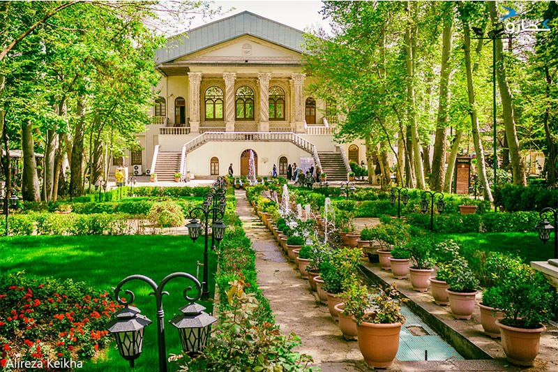
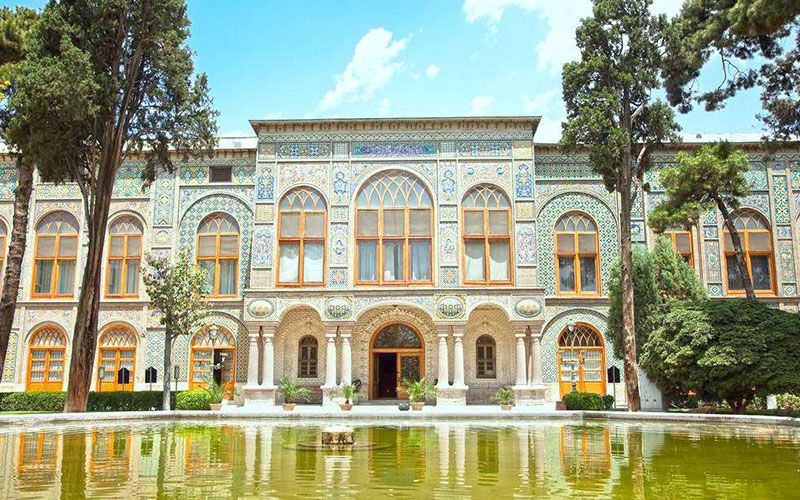
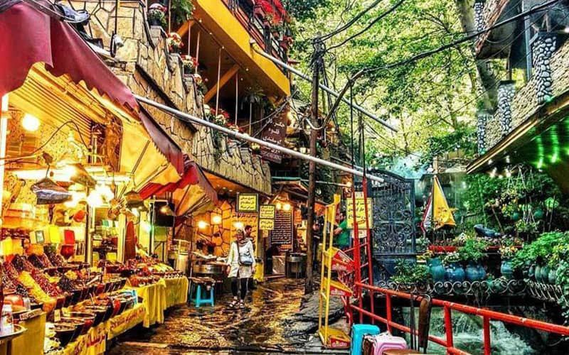

## باغ فردوس

- آدرس:
ایران، استان تهران، تهران، خیابان ولیعصر (شمال)، بعد از سه راه زعفرانیه، نرسیده به تجریش

باغ فردوس تهران یکی از باغ‌های زیبای پایتخت محسوب می‌شود که از زمان قاجار به یادگار مانده است. این باغ که در حوالی میدان تجریش قرار دارد، به موزه سینما اختصاص داده شده و با داشتن امکاناتی چون سالن‌های سینما،کافه و محیطی دل‌نواز و سرسبز یکی از پاتوق‌های هنرمندان و هنردوستان است

## کاخ گلستان

- آدرس:
ایران، استان تهران، تهران، خیابان پانزده خرداد، ضلع شمالی میدان ارگ، کاخ گلستان

کاخ گلستان یکی از آثار جهانی ایران در فهرست میراث یونسکو است که به‌لطف معماری و تزیینات منحصربه‌فرد، محلی ایدئال برای عکاسی و ثبت تصاویر فوق‌العاده زیبا به شمار می‌رود. این بنای ارزشمند در سال ۱۳۳۴ در فهرست آثار ملی ايران و در سال ۱۳۹۲ در فهرست ميراث جهانی یونسکو به ثبت رسید. علاوه بر این، وقوع رخدادهای تاریخی مهم در این محل، آن را به سندی زنده از تاریخ ایران تبدیل کرده است. این مجموعه که از جاهای دیدنی تهران به حساب می‌آید، در بافت قدیمی شهر قرار دارد و به‌راحتی می‌توان با وسایل حمل‌ونقل عمومی به آن دسترسی داشت و مسحور اين همه زيبايی، تاريخ، معماری، فرهنگ و هنر ایران شد

## دربند

- آدرس:
ایران، استان تهران، شهر تهران، میدان تجریش، خیابان دربند، میدان سربند

دربند، منطقه‌ای عالی با آب‌وهوای دلپذیر است که پایتخت‌نشینان زیادی از شلوغی و ترافیک و آلودگی هوای شهر، به این محل پناه می‌برند تا هم از چشم‌انداز فوق‌العاده زیبای آن لذت ببرند، هم در رستوران‌های متعدد آن یک وعده غذای لذیذ نوش جان کنند؛ اما این همه ماجرا نیست و بدون اینکه نیازی باشد از تهران فاصله بگیرند، می‌توانند به کوه‌نوردی بپردازند و از هوای مطبوع و محیط دیدنی آن استفاده کنند. پیاده‌روی در مسیر سنگی دربند و عبور از کنار غذاخوری‌های گوناگون و دست‌فروشان و خوردن انواع آلو، لواشک، ترشک، باقالی، بلال و... همان چیزی است که جذابیتی دوچندان به دربند بخشیده‌ است

می توانید مکان های دیدنی بیشتری را از این
[لینک](https://www.kojaro.com/attraction/list/%D8%AA%D9%87%D8%B1%D8%A7%D9%86-118-ci/sort/13/)
ببینید
