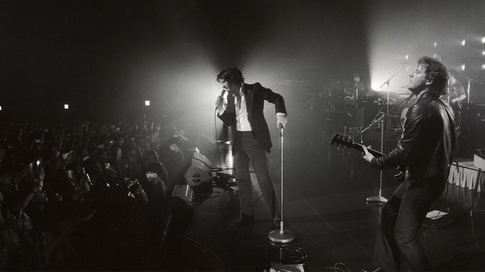
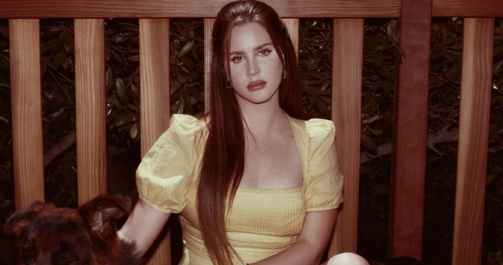
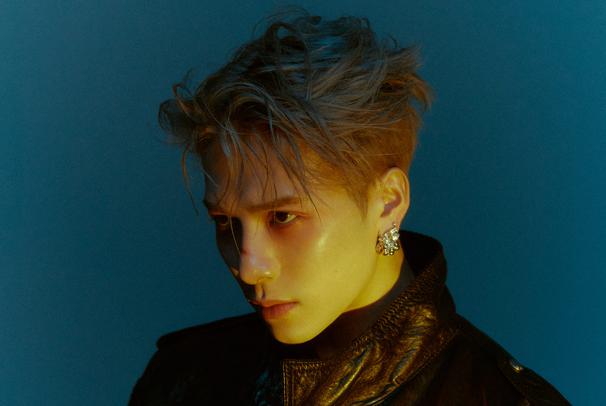

- یکی از سرگرمی های من گوش دادن به موسیقی است. موسیقی زیبا می تواند به انسان روحیه خوبی بدهد و با گوش دادن به آن انرژی بگیرد. زندگی بدون موسیقی اشتباهی بیش نیست.
- سبک های موسیقی زیادی وجود دارد که برخی از شاخه های اصلی آن عبارتند از: کلاسیک، بلوز، راک،هیپ هاپ، رپ، پاپ، ار اند بی و...سبک های موسیقی موردعلاقه من کلاسیک، راک، پاپ و رپ هستند. 

## خواننده های مورد علاقه من

