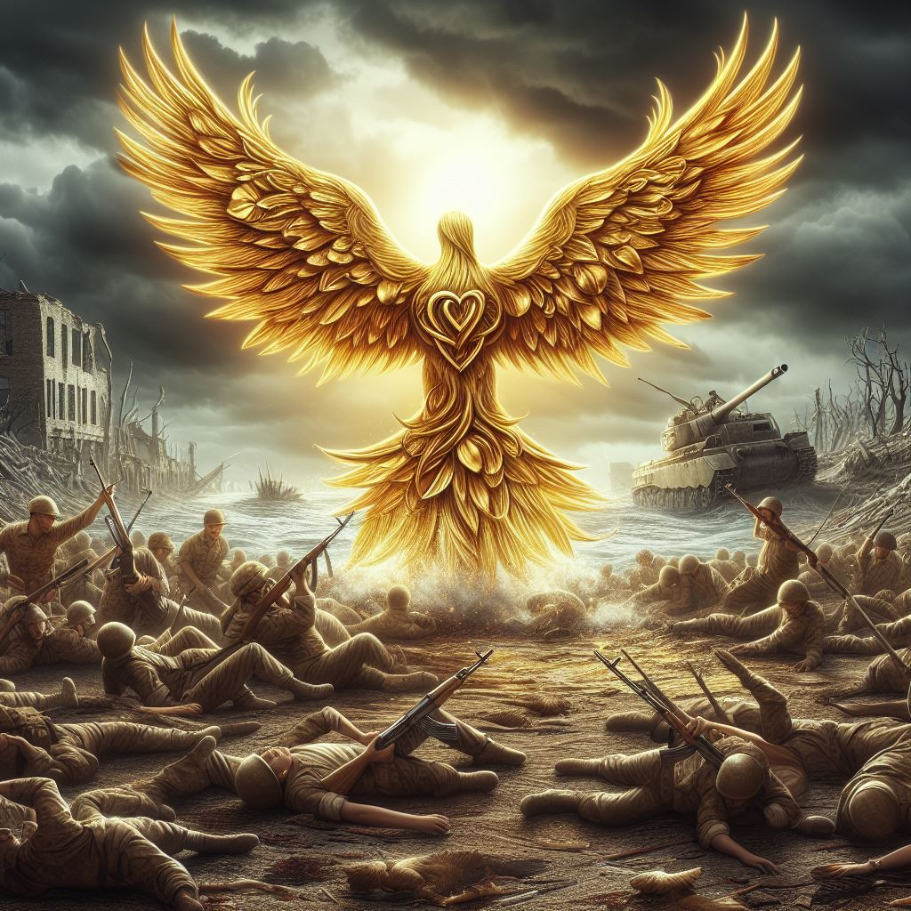
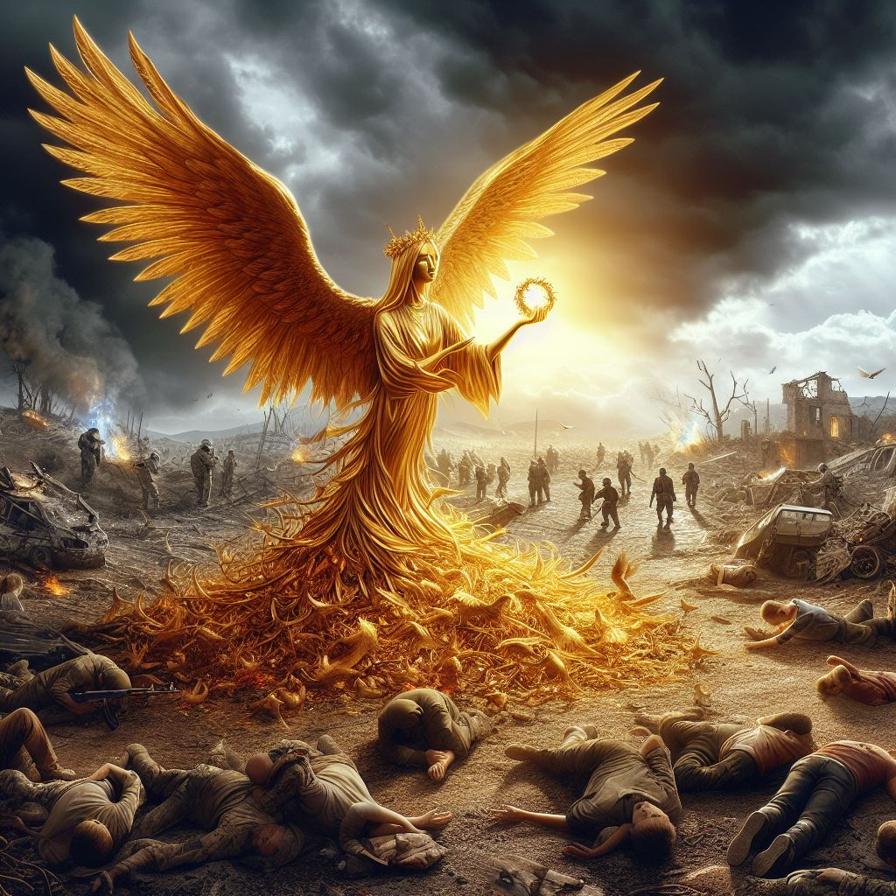
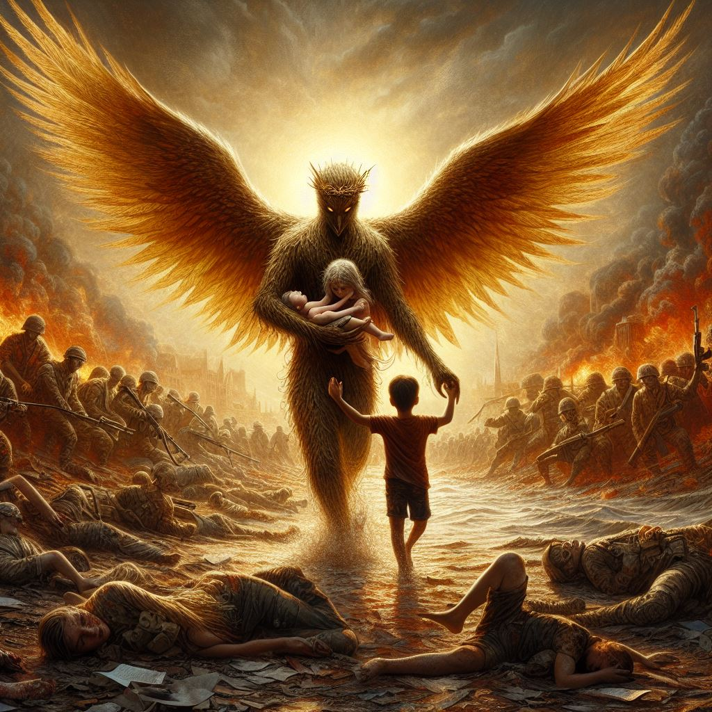
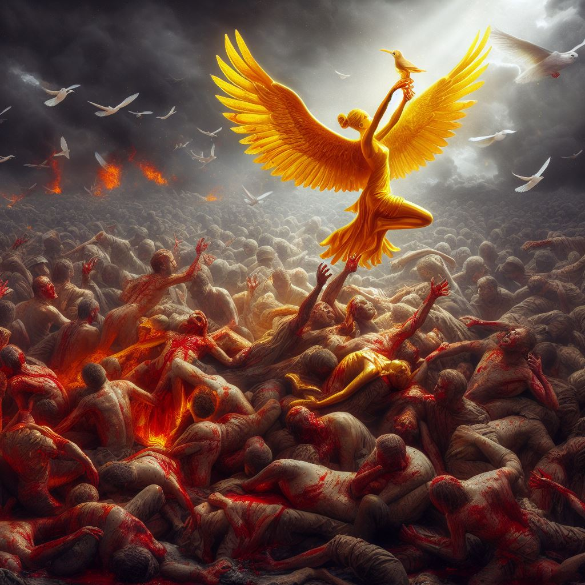
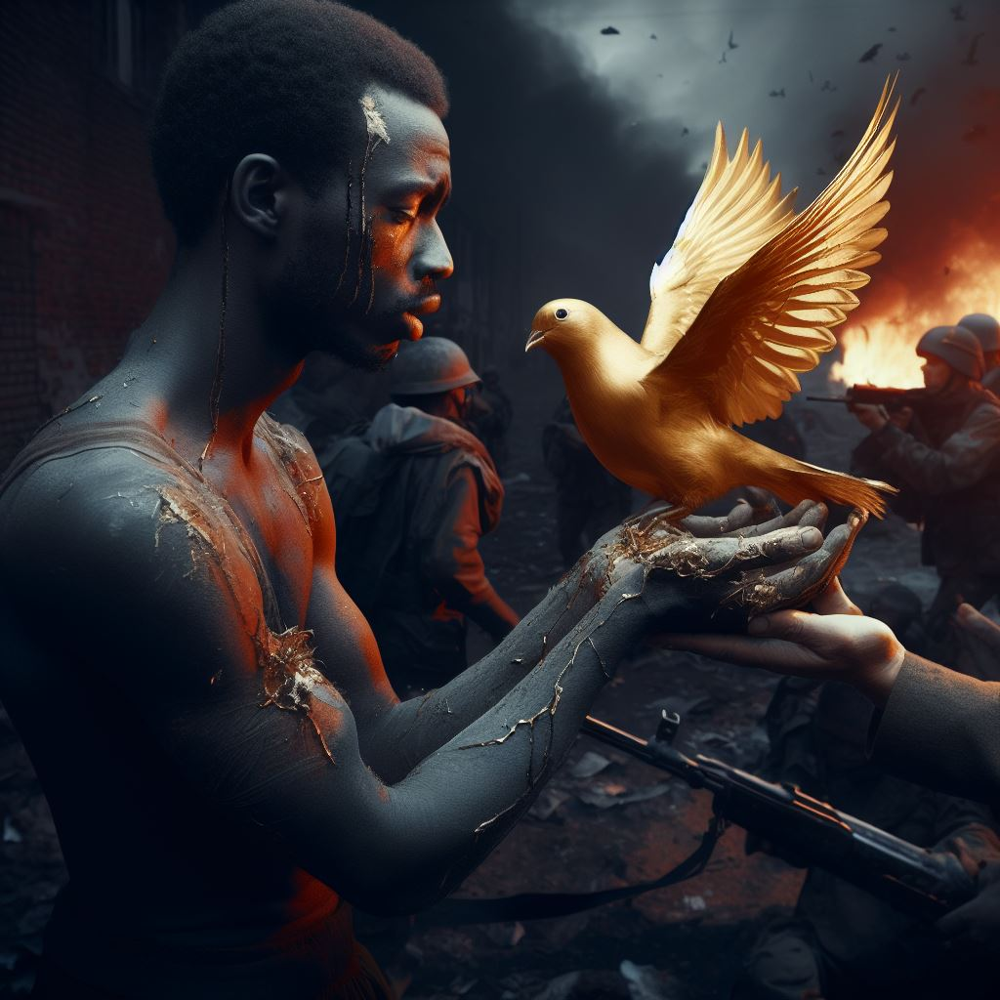
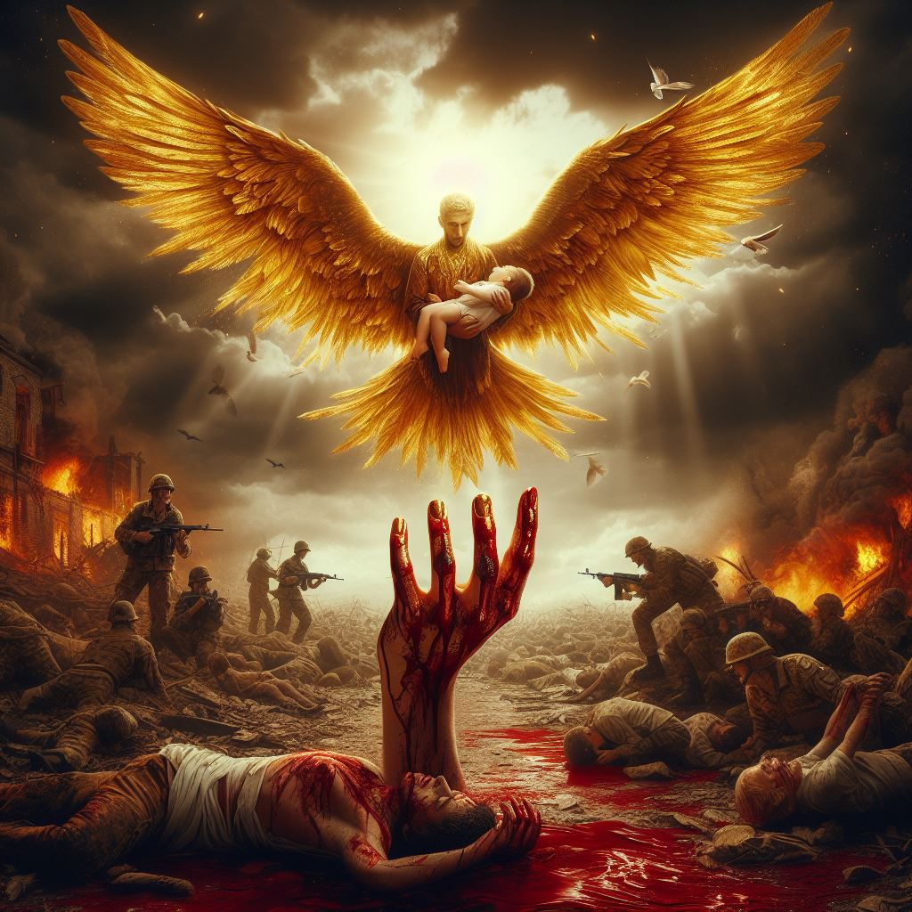
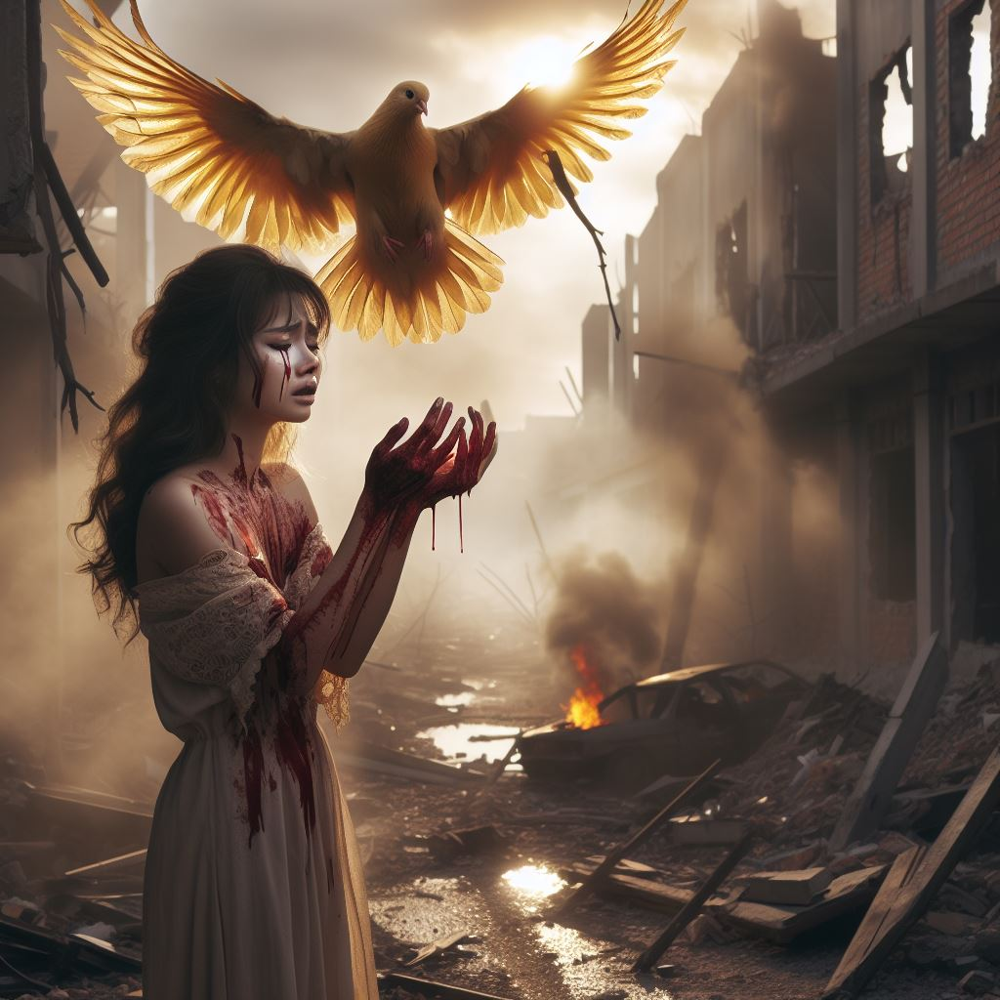
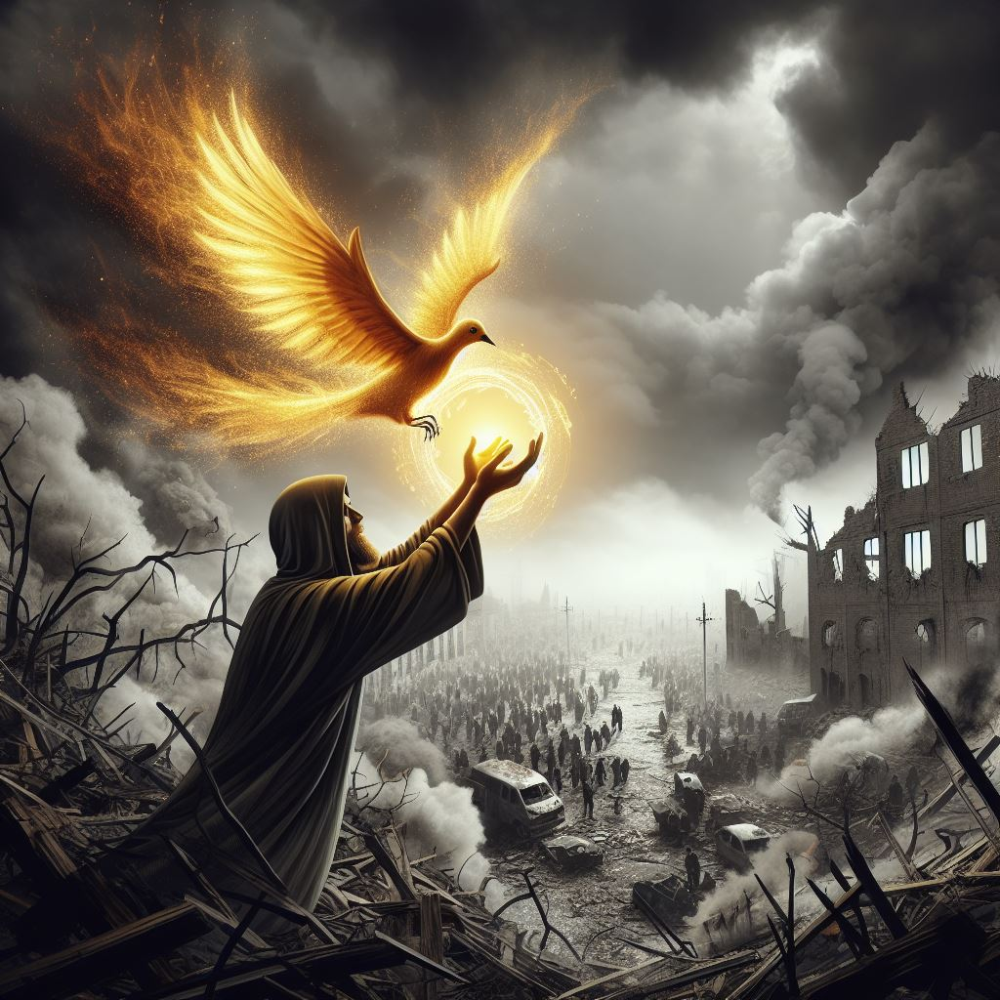
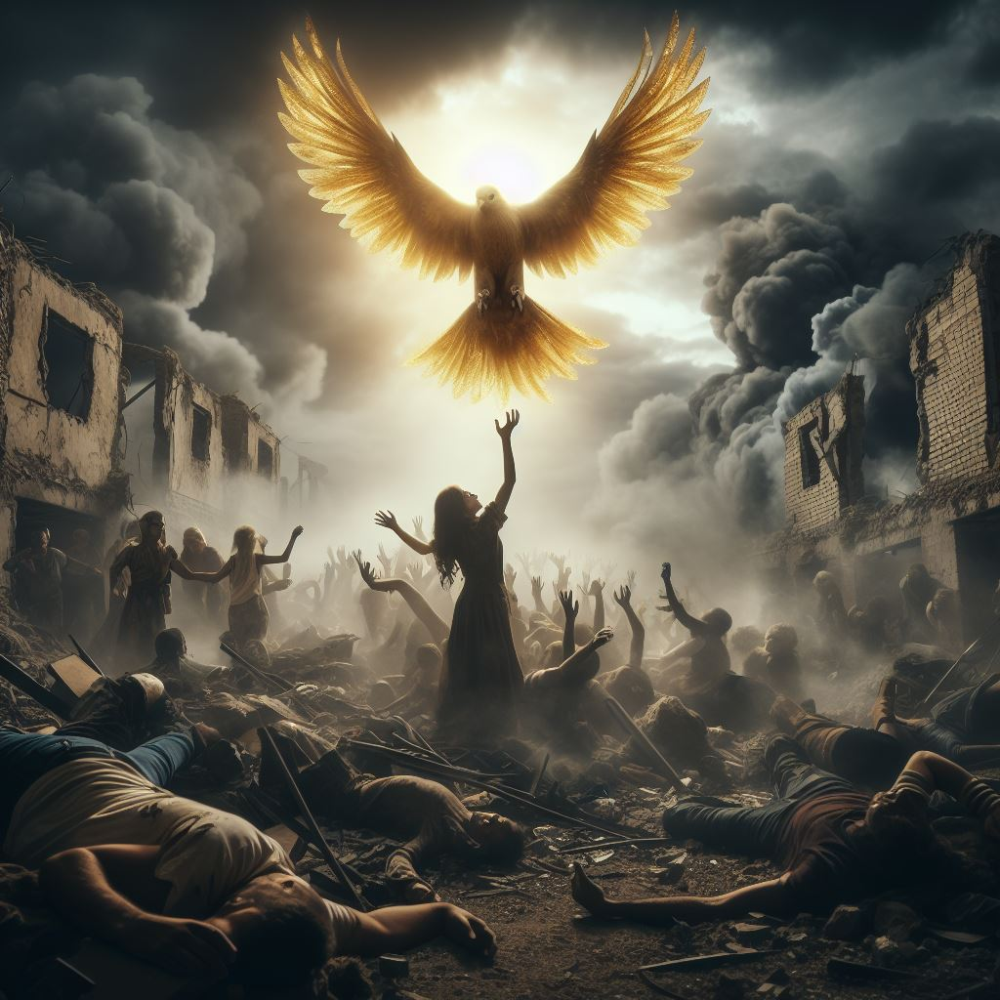
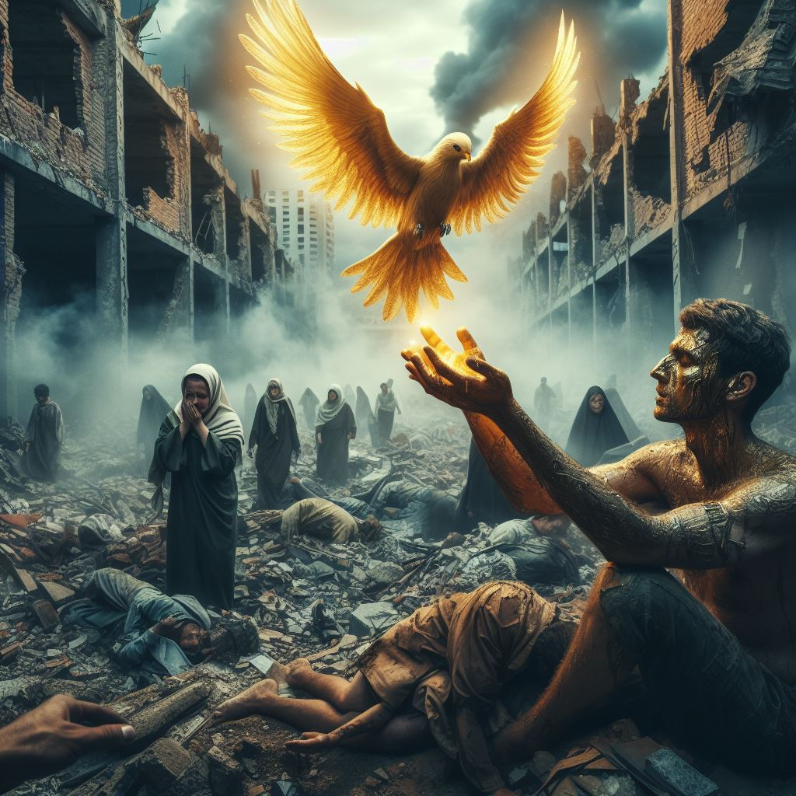

## How to Produce artwork using artificial intelligence
- You can generate your desired synthetic image about a topic.
For this purpose, you can use this [site](https://www.bing.com/images/create) to produce creative and beautiful images.

- 1: In the middle of a terrible war where innocent people are being killed, hope comes to their rescue like a beautiful golden bird...

- 2: In the middle of a terrible bloody war where innocent people are being killed, hope comes to their rescue like a beautiful golden bird...and catch their hands

- 3: In the middle of a terrible bloody war where innocent people are being killed, hope comes to their rescue like a beautiful golden bird...and catch their hands...while they are crying

- 4: In the middle of a terrible bloody war where innocent people are being killed, hope comes to their rescue like a beautiful golden bird...and catch their hands...while they are crying...Ruined buildings due to war, smoke and dust fill the air

- 5: In the middle of a terrible bloody war where innocent people are being killed, hope comes to their rescue like a beautiful golden bird...and catch their hands...while they are crying...Ruined buildings due to war, smoke and dust fill the air...pain and despair can be seen on people's faces.

