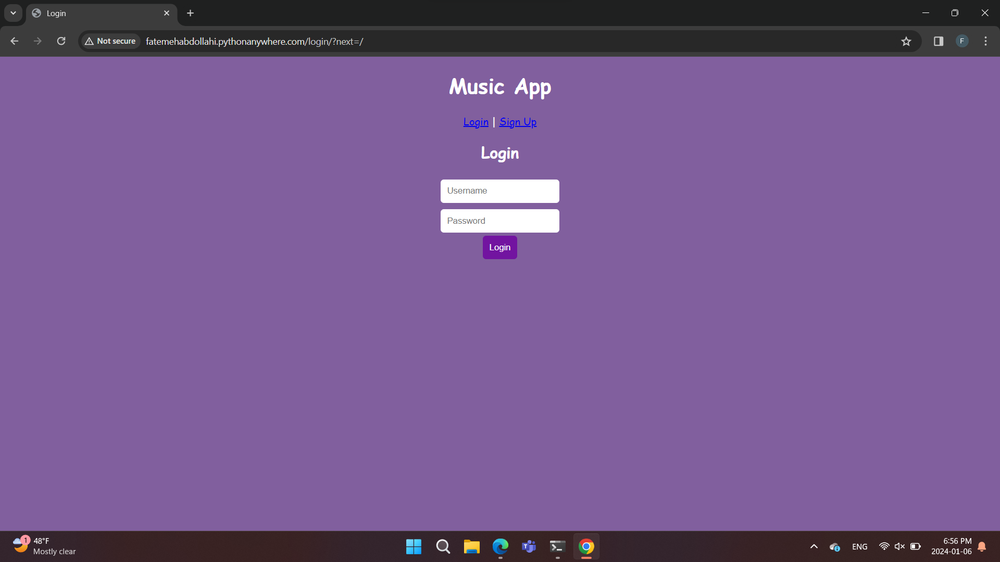
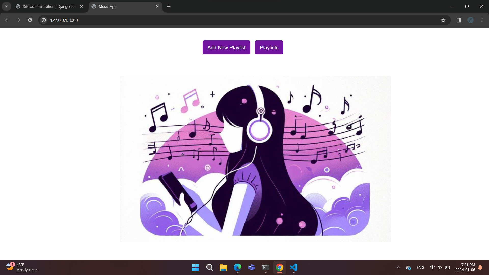
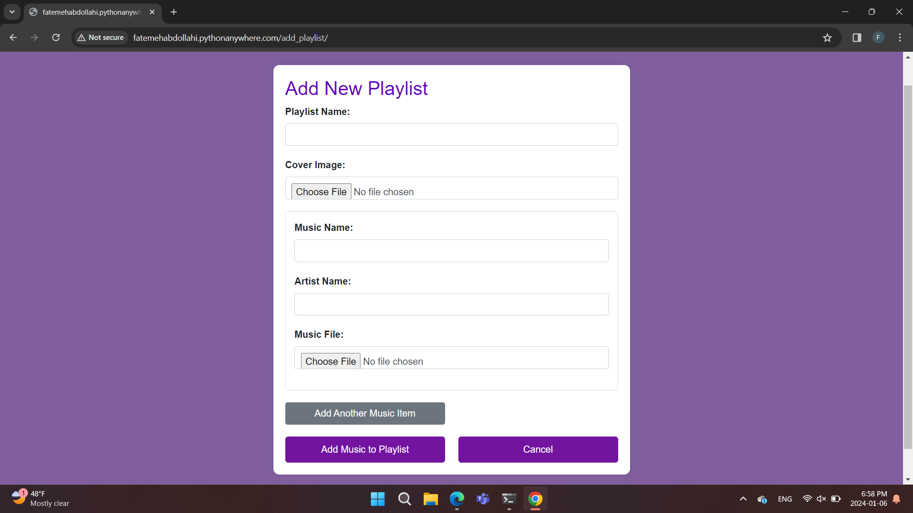
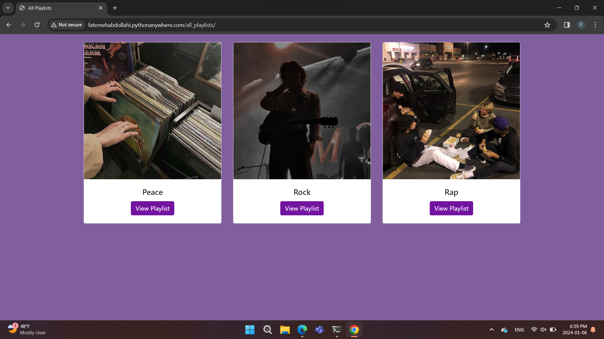
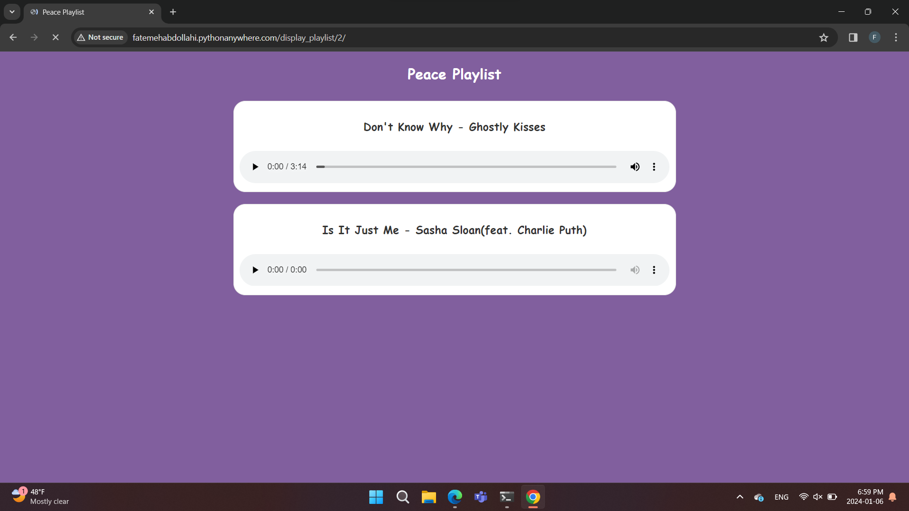

- This blog is about my project that I decided to create a web application about making music playlists where everyone can share and enjoy their favorite music.
Here you can see the stages and different parts of my project along with their pictures.

- When you open my web application, the first thing you see is the log in page where you have to enter your password and username.

-After you enter the app, the home screen will open for you, where there are two options that you can choose.

-If you select the add new playlist button, you will enter a page where you can choose your favorite music from your files and choose a photo for your playlist.
Unfortunately, this app cannot save your data and music. I spent a lot of time trying to solve this problem but I couldn't solve it.

-If you select the Playlists button, a page will open for you where there are added Playlists. You can click on your favorite playlists and enjoy the music.

-This is the page that opens for you when you click on a playlist. The name of the song and the singer will be displayed, which you can choose and listen to.

-During this project, I got help from chat GBT and comments from some of my friends. I also used bootstrap to decorate the pages. This is my app [link](http://fatemehabdollahi.pythonanywhere.com/). I hope you enjoy it.